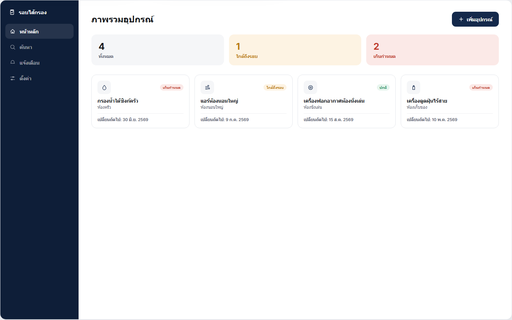
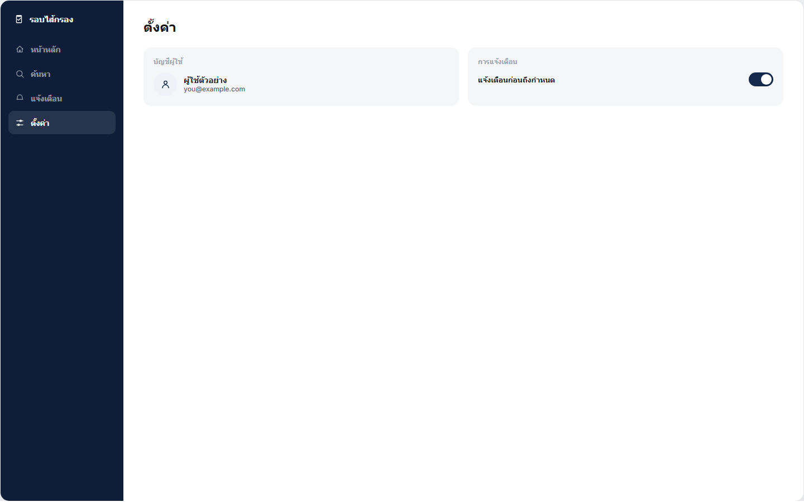

# รอบไส้กรอง (FilterCycle) — รหัสไอเดียภายใน: ลงทะเบียนอุปกรณ์ / #2

## ภาพรวม
"รอบไส้กรอง" เป็นแอปมือถือ (แนว PWA) ที่แก้ปัญหาเดียวให้ตรงจุด: คนมักลืมเปลี่ยนไส้กรองของเครื่องกรองน้ำ
แอร์ เครื่องฟอกอากาศ และเครื่องดูดฝุ่น จนของเสียหรือสกปรกเกินไป ผู้ใช้ลงทะเบียนอุปกรณ์แต่ละชิ้นครั้งเดียว
ระบบจะคำนวณรอบเปลี่ยนให้อัตโนมัติ แจ้งเตือนก่อนถึงกำหนด พร้อมลิงก์สั่งซื้อไส้กรองรุ่นเดิมได้ในคลิกเดียว

หมวด: บ้านและของใช้ในบ้าน · Fidelity: hi-fi ทิศทางภาพเดียว (โทนน้ำเงินเข้ม-ขาว แบบช่าง/วิศวกร)
แพลตฟอร์ม: มือถือเป็นหลัก (390px) พร้อมเวอร์ชันเดสก์ท็อป (1440px) เฉพาะหน้าภาพรวมอุปกรณ์และหน้าตั้งค่า

## ไฟล์ที่ส่งมอบ
- `DeviceRegistration.dc.html` — แอปที่ใช้งานได้จริงแบบ single-flow ทุกหน้าจอผูกกับ state จริง และบันทึกลง
  `localStorage` ดังนั้นการเพิ่มอุปกรณ์ การกดทำเครื่องหมายว่าเปลี่ยนแล้ว การเลื่อนแจ้งเตือน การส่งออก CSV
  หรือการสลับภาษา จะเห็นผลจริงและอยู่ครบแม้รีเฟรชหน้า
- `DeviceRegistrationOverview.dc.html` — แกลเลอรีแบบ static ที่แพน/ซูมได้ รวมหน้าจอทั้ง 13 เฟรม
  (สมัคร/เข้าสู่ระบบ, หน้าหลักสำคัญ, หน้าสนับสนุน, สถานะว่าง/ผิดพลาด, เวอร์ชันเดสก์ท็อป) แยกเป็นเฟรมเดี่ยว
  เพื่อรีวิวทีละหน้าได้สะดวก
- `ios-frame.jsx` — คอมโพเนนต์กรอบอุปกรณ์ iPhone ที่ใช้ร่วมกันในไฟล์ทั้งสองด้านบน ไม่ใช่หน้าจอของแอปเอง
- `images/device-*.png` — ภาพประกอบอุปกรณ์ที่สร้างขึ้น (หนึ่งภาพต่อประเภทอุปกรณ์: ไส้กรองน้ำ ไส้กรองแอร์
  ไส้กรองเครื่องฟอกอากาศ ไส้กรองเครื่องดูดฝุ่น) ใช้แทนภาพถ่ายจริงในหน้าเพิ่มอุปกรณ์และหน้ารายละเอียด

## วิธีเปิด / รัน
ไฟล์ `.dc.html` ทั้งสองเป็นเอกสาร HTML แบบสมบูรณ์ในตัวเอง — ดับเบิลคลิกหรือเปิดด้วยเบราว์เซอร์สมัยใหม่
(Chrome, Safari, Edge) ได้ทันที ไม่ต้อง build ไม่ต้องมีเซิร์ฟเวอร์ ไม่ต้องติดตั้งอะไรเพิ่ม แอปอ่าน/เขียน
`localStorage` ภายใต้คีย์ `filterCycle.*` ข้อมูล (อุปกรณ์, ภาษาที่เลือก) จึงอยู่ครบเมื่อกลับมาเปิดซ้ำใน
เบราว์เซอร์เดิม

## ฟีเจอร์ (แอปที่ใช้งานได้จริง)
- หน้าแนะนำแอป เข้าสู่ระบบ และสมัครสมาชิก (จำลองระบบยืนยันตัวตน — กรอกอีเมล/รหัสผ่านอะไรก็เข้าได้)
- หน้าหลัก: รายการอุปกรณ์ แต่ละการ์ดมีวงแหวนแสดงความคืบหน้า ป้ายสถานะ (ปกติ / ใกล้ถึงรอบ / เกินกำหนด)
  และวันที่เปลี่ยนถัดไป พร้อมสรุปยอดรวมด้านบน
- เพิ่ม/แก้ไขอุปกรณ์: ชื่อเรียก ประเภท ยี่ห้อ/รุ่น (ข้อมูลตัวอย่าง แก้ไขได้) ตำแหน่งติดตั้ง วันที่เปลี่ยนล่าสุด
  รอบเปลี่ยน (ปุ่มลัด 30/60/90/180 วัน หรือกำหนดเอง) และหมายเหตุ พร้อมตรวจสอบข้อมูลจำเป็นและแจ้ง error
  แบบ inline
- รายละเอียดอุปกรณ์: วงแหวนขนาดใหญ่ ประวัติการเปลี่ยน ปุ่ม "ทำเครื่องหมายว่าเปลี่ยนวันนี้" (คำนวณวันที่
  เปลี่ยนถัดไปใหม่ทันที) และปุ่ม "สั่งซื้อไส้กรองรุ่นเดิม" ที่ลิงก์ไปหน้าสั่งซื้อตัวอย่างของรุ่นนั้น
  มีขั้นตอนลบอุปกรณ์พร้อมยืนยันก่อนลบจริง
- ค้นหาและกรอง: ค้นหาด้วยคำ พร้อมตัวกรองตามสถานะและประเภทอุปกรณ์
- การแจ้งเตือน: แจ้งเตือนที่ระบบสร้างให้อัตโนมัติสำหรับอุปกรณ์ที่ใกล้ถึงรอบหรือเกินกำหนด แต่ละรายการมีปุ่ม
  "ดูอุปกรณ์" และ "เลื่อนแจ้งเตือน 7 วัน"
- ตั้งค่า: บัญชีผู้ใช้ สวิตช์แจ้งเตือนและระยะเวลาล่วงหน้า ส่งออก CSV (ดาวน์โหลดไฟล์จริง) รีเซ็ตข้อมูล
  ตัวอย่าง ลบอุปกรณ์ทั้งหมด (นำไปสู่สถานะว่าง) และสวิตช์ "จำลองข้อผิดพลาด" สำหรับสาธิตสถานะข้อผิดพลาด
  อย่างปลอดภัยโดยไม่ต้องรอเน็ตล่มจริง
- สถานะว่างและสถานะข้อผิดพลาด เข้าถึงได้จากแอปจริง (ลบอุปกรณ์ทั้งหมด / สลับสวิตช์จำลองข้อผิดพลาดในหน้า
  ตั้งค่า) ไม่ใช่แค่ภาพจำลองแยกหน้า
- เวอร์ชันเดสก์ท็อป (1440px): เลย์เอาต์สองส่วน (แถบเมนู + เนื้อหา) เฉพาะหน้าภาพรวมอุปกรณ์และหน้าตั้งค่า
  สลับได้จากปุ่มบนแถบด้านบน

## การสลับภาษา (ไทย / อังกฤษ)
ทุกหน้าจอ ข้อความตรวจสอบ ข้อความสถานะว่าง/ผิดพลาด/สำเร็จ และข้อมูลตัวอย่าง (ชื่ออุปกรณ์ ตำแหน่ง หมายเหตุ)
มีครบทั้งภาษาไทยและอังกฤษ กดปุ่ม "TH / EN" บนแถบด้านบนของ `DeviceRegistration.dc.html` เพื่อสลับได้ทุกเมื่อ
ระบบจำค่าที่เลือกไว้และใช้ต่อเมื่อเปิดใหม่ วันที่จะแสดงผลตามปฏิทินที่เหมาะกับภาษานั้น (พ.ศ. สำหรับไทย,
ค.ศ. สำหรับอังกฤษ)

## ที่มาของชื่อแอป
รหัสไอเดียภายในคือ "ลงทะเบียนอุปกรณ์" (Device Registration, #2) ซึ่งอธิบายกลไกอินพุตมากกว่าจะเป็นชื่อ
ผลิตภัณฑ์ที่จำง่าย จึงตั้งชื่อแบรนด์ที่ใช้ใน UI จริงว่า "รอบไส้กรอง" (อังกฤษ: FilterCycle) แทน โดยเก็บ
รหัสไอเดียเดิมไว้ในเอกสารนี้เพื่อการอ้างอิง

## ข้อจำกัด
- ระบบยืนยันตัวตนเป็นการจำลองเท่านั้น (ไม่มีเซิร์ฟเวอร์จริง ไม่มีกฎรหัสผ่าน) เพราะนี่คือต้นแบบฝั่งหน้าบ้าน
  ไม่ใช่ระบบ auth ที่ใช้งานจริง
- ชื่อยี่ห้อ/รุ่น และลิงก์สั่งซื้อเป็นข้อมูลตัวอย่าง มีระบุไว้ชัดเจนใน UI ว่าเป็นตัวอย่าง
- การแจ้งเตือนแบบ push แสดงผลเป็นการแจ้งเตือนภายในแอป (หน้าการแจ้งเตือน) เอกสารส่งมอบนี้ยังไม่รวมการเชื่อม
  ต่อ push notification ของอุปกรณ์จริง
- มีเพียง 2 หน้า (ภาพรวมอุปกรณ์, ตั้งค่า) ที่มีเลย์เอาต์เดสก์ท็อปโดยเฉพาะ ตรงตามโจทย์ที่ระบุ ส่วนหน้าอื่น
  ออกแบบมาสำหรับมือถือเท่านั้นโดยตั้งใจ

## ภาพประกอบ

| ภาพรวมอุปกรณ์เดสก์ท็อป | ตั้งค่าเดสก์ท็อป |
| --- | --- |
|  |  |

## คลังโค้ด

https://github.com/papayiw-git/device-registration
